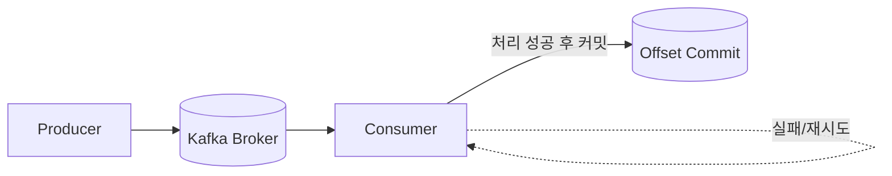

# Chapter 04 - 메시지 모델과 전달 보장

- 상태: 초안 완료
- 목표 분량: 10쪽

## 학습 목표
- 전달 보장 모델을 구분할 수 있다.
- 중복/유실 리스크를 설명할 수 있다.
- 요구사항에 맞는 보장 수준을 선택할 수 있다.

## 핵심 개념

- At-most-once: 유실 가능, 중복 적음
- At-least-once: 중복 가능, 유실 줄임
- Exactly-once: 복잡도/비용 증가, 강한 보장

실무 기본은 at-least-once + idempotent 소비자입니다.

## 직관 그림



핵심 해석:
- 커밋 시점이 너무 빠르면 유실 위험이 커집니다.
- 커밋 시점이 늦으면 중복 처리 가능성이 커집니다.

## 실습 예제

```bash
docker exec -it idea3-kafka kafka-console-consumer --bootstrap-server localhost:9092 --topic order.events --from-beginning --property print.offset=true
```

## 설계 포인트
- 보장 수준은 지연/복잡도와 함께 선택한다.
- 중복 처리는 소비자에서 기본으로 대비한다.
- 커밋 시점과 실패 재시도를 한 세트로 정의한다.

## 자주 하는 실수
1. exactly-once를 무조건 적용
2. idempotency 없이 중복을 가정하지 않음
3. 커밋 정책 문서화 누락

## 요약
- 전달 보장은 비즈니스 요구와 비용의 균형 문제다.
- 보장 수준만큼 소비자 설계도 중요하다.

## 초보자 체크
- at-most / at-least / exactly-once 차이를 예시로 설명할 수 있는가?
- "중복은 언제 생기고, 어떻게 막을지"를 말할 수 있는가?

## 연습문제
### 기초
1. 세 전달 보장 차이를 비교해보세요.
2. 중복이 생기는 이유를 설명해보세요.

### 응용
1. 결제 이벤트 보장 수준을 제안해보세요.
2. 중복 처리 규칙을 작성해보세요.

## 챕터 체크리스트
- [x] 초안 작성 완료
- [x] 예제 명령어 검증 완료
- [x] 초보자 기준 용어 설명 완료
- [x] 최종 교정 완료
