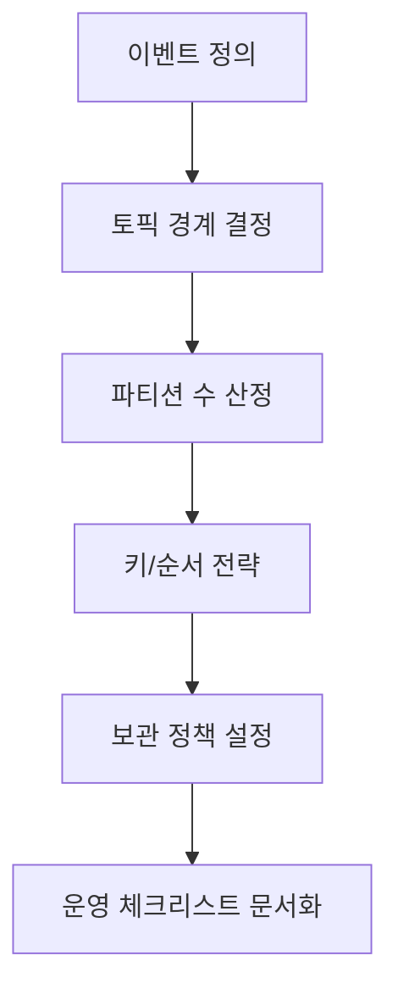

# Chapter 06 - Topic/Partition 설계

- 상태: 초안 완료
- 목표 분량: 11쪽

## 학습 목표
- 토픽 경계와 네이밍 규칙을 설계할 수 있다.
- 파티션 수를 처리량/순서 요구에 맞춰 결정할 수 있다.
- 장기 운영을 고려한 토픽 정책을 정리할 수 있다.

## 핵심 개념

토픽 설계는 Kafka 품질의 시작점입니다.
토픽이 도메인 경계를 잘 반영하면 소비자 책임이 명확해지고,
토픽이 뒤섞이면 재처리/권한/보관 정책이 모두 꼬입니다.

파티션 수는 "현재 트래픽"이 아니라
"피크 + 성장 + 소비 병렬성" 기준으로 잡아야 합니다.

## 직관 그림



## 실습 예제

```bash
docker exec -it idea3-kafka kafka-topics --bootstrap-server localhost:9092 --create --topic payment.events.v1 --partitions 6 --replication-factor 1

docker exec -it idea3-kafka kafka-topics --bootstrap-server localhost:9092 --describe --topic payment.events.v1
```

## 설계 포인트
- 토픽 이름에 도메인/이벤트 성격/버전 규칙을 포함한다.
- 파티션 증가 시 리밸런스 비용을 사전에 감안한다.
- retention/cleanup.policy를 토픽 목적과 함께 문서화한다.

## 자주 하는 실수
1. 모든 이벤트를 하나의 거대 토픽에 몰아넣음
2. 순서 요구를 무시하고 과도한 파티션 확장
3. 토픽 버전 전략 없이 스키마를 직접 변경

## 요약
- 토픽/파티션 설계는 운영 안정성의 기초다.
- 이름 규칙, 파티션 수, 보관 정책을 함께 결정해야 한다.

## 초보자 체크
- 토픽 이름 규칙을 팀 표준으로 제안할 수 있는가?
- 파티션 수를 "숫자 근거"와 함께 설명할 수 있는가?

## 연습문제
### 기초
1. 본인 서비스의 이벤트 토픽 3개를 설계해보세요.
2. 파티션 수 결정 기준을 표로 작성해보세요.

### 응용
1. 성장률 2배를 가정한 파티션 재설계안을 작성해보세요.
2. 토픽 정책 표준 템플릿을 작성해보세요.

## 챕터 체크리스트
- [x] 초안 작성 완료
- [x] 예제 명령어 검증 완료
- [x] 초보자 기준 용어 설명 완료
- [ ] 최종 교정 완료
