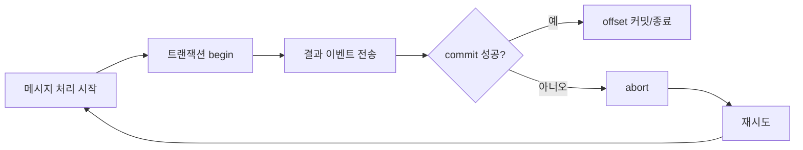

# Chapter 13 - Exactly-Once와 트랜잭션

- 상태: 초안 완료
- 목표 분량: 11쪽

## 학습 목표
- EOS(Exactly-Once Semantics) 개념을 설명할 수 있다.
- idempotent producer와 transaction의 관계를 이해한다.
- 적용 범위를 현실적으로 결정할 수 있다.

## 핵심 개념

Exactly-Once는 "중복 제거 + 원자적 커밋"의 조합입니다.
하지만 복잡도와 비용이 높아 모든 경로에 적용하는 전략은 비효율적일 수 있습니다.

## 오해 바로잡기

1. "EOS = 절대 중복 0건"
- EOS는 Kafka 경계 내 중복/유실 제어를 강화합니다.
- 외부 DB/API까지 자동으로 exactly-once가 보장되지는 않습니다.

2. "Producer 설정만 켜면 끝"
- `enable.idempotence`만으로는 부족합니다.
- 소비자 재처리, 외부 저장소 업데이트의 멱등성까지 함께 설계해야 합니다.

3. "모든 토픽에 EOS 적용이 정답"
- 지불/정산 같은 고위험 경로 우선 적용이 일반적입니다.
- 저위험 이벤트는 at-least-once + 멱등 소비가 더 단순하고 비용 효율적입니다.

## 직관 그림

```text
일반 at-least-once:
  전송 성공 후 재시도 가능 -> 중복 가능

EOS:
  idempotent producer + transaction 경계
  -> 중복/유실 제어 강화 (대신 운영 복잡도 증가)
```

핵심 판단 질문:
- 중복 1건이 치명적인가?
- 성능 저하/운영 복잡도를 감당할 가치가 있는가?

## 실습 예제

실습 목적: producer 트랜잭션 최소 설정을 이해하고 실패 시 동작을 예측합니다.

```properties
enable.idempotence=true
transactional.id=payment-tx-producer-1
acks=all
retries=2147483647
max.in.flight.requests.per.connection=5
```

관찰 포인트:
- 트랜잭션 경계가 깨지면 처리 지연과 운영 복잡도가 증가함

## 필수 설정 체크표

| 영역 | 핵심 설정 | 이유 |
|---|---|---|
| Producer | `enable.idempotence=true` | 재시도 중복 전송 완화 |
| Producer | `transactional.id` | 트랜잭션 세션 식별 |
| Producer | `acks=all` | 복제본 기준 내구성 강화 |
| Consumer | `isolation.level=read_committed` | 커밋 완료 트랜잭션만 읽기 |
| App | 멱등 키/중복 방지 저장소 | Kafka 외부 부작용 제어 |

## 실패 시나리오(개념)



실패 시 확인 항목:
- transaction timeout 초과 여부
- producer fencing(중복 인스턴스) 발생 여부
- 소비자 `read_committed` 설정 누락 여부

## 설계 포인트
- 핵심 금전/정산 이벤트만 우선 적용한다.
- 일반 이벤트는 at-least-once + idempotent 소비로 충분한지 검토한다.
- 트랜잭션 장애 시 복구 절차를 문서화한다.

## 자주 하는 실수
1. EOS를 만능처럼 적용
2. 트랜잭션 타임아웃/에러 경로 미검증
3. 소비자 idempotency 없이 producer 설정만 강화

## 요약
- EOS는 강력하지만 비싸다.
- 도메인 위험도 기반으로 선택해야 한다.

## 초보자 체크
- EOS를 쓰지 않아도 안전하게 만들 방법(idempotent 소비)을 설명할 수 있는가?
- "어디에 EOS를 쓰고, 어디는 안 쓸지" 기준을 제시할 수 있는가?

## 연습문제
### 기초
1. idempotence와 transaction 차이를 설명해보세요.
2. EOS가 필요한 케이스를 1개 제시해보세요.

### 응용
1. 결제 이벤트에 EOS 적용 범위를 설계해보세요.
2. 비적용 경로의 보완책을 작성해보세요.

## 예제 명령어 검증 시나리오(권장)

사전 조건:
- 트랜잭션 producer 샘플 앱(고정 `transactional.id`) 준비
- 동일 토픽을 `read_committed`, `read_uncommitted`로 각각 소비 가능
- 빠른 검증: `./scripts/verify_kafka_eos.sh`

검증 절차:
1. 트랜잭션 producer로 이벤트 10건 전송
2. 전송 중 producer 강제 재시작(중단/복구)
3. `read_committed` 소비 결과와 `read_uncommitted` 소비 결과 비교

성공 기준:
- `read_committed`에서 abort된 레코드가 노출되지 않음
- 중단/복구 후에도 중복 이벤트가 업무적으로 허용 가능한 범위로 제어됨
- producer fencing/timeout 발생 시 복구 절차로 정상 전환 가능

## 챕터 체크리스트
- [x] 초안 작성 완료
- [x] 예제 명령어 검증 완료
- [x] 초보자 기준 용어 설명 완료
- [ ] 최종 교정 완료
