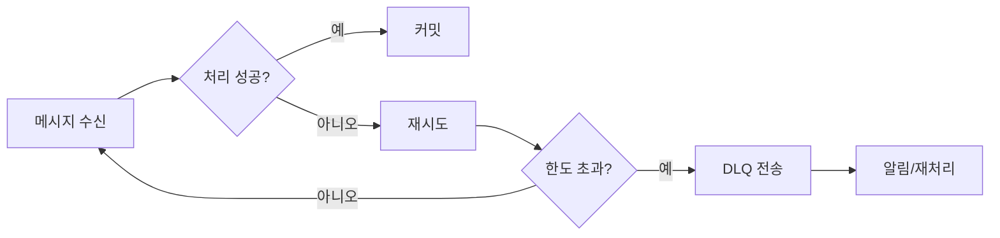

# Chapter 14 - DLQ/재시도/에러 처리

- 상태: 초안 완료
- 목표 분량: 11쪽

## 학습 목표
- 실패 처리 전략(DLQ/재시도)을 설명할 수 있다.
- 에러 유형별 대응 정책을 수립할 수 있다.
- 운영 중 실패 누적을 관측/완화할 수 있다.

## 핵심 개념

실패는 예외가 아니라 정상 시나리오입니다.
중요한 것은 실패를 숨기지 않고 분리/추적/재처리하는 구조입니다.

## 실습 예제

```text
처리 실패 -> 재시도 N회 -> 실패 지속 시 DLQ 토픽 전송 -> 운영 알림 -> 수동/자동 재처리
```



실패 해석 힌트:
- 같은 오류가 짧은 시간에 반복되면 "영구 실패" 가능성을 의심합니다.
- 외부 시스템 타임아웃 증가와 함께 발생하면 "일시 실패" 가능성이 큽니다.

## 설계 포인트
- 영구 실패(데이터 불량)와 일시 실패(외부 장애)를 분리한다.
- DLQ 메시지에 원인/재처리 키를 포함한다.
- 재시도 폭주가 원본 시스템을 무너뜨리지 않게 백오프를 설계한다.

## 자주 하는 실수
1. 모든 실패를 무한 재시도
2. DLQ에 원인 정보 미포함
3. 재처리 절차 문서 부재

## 요약
- 실패 처리 구조가 Kafka 운영 품질을 결정한다.
- 재시도와 DLQ는 반드시 세트로 설계해야 한다.

## 초보자 체크
- 일시 실패와 영구 실패를 로그 예시로 구분할 수 있는가?
- DLQ 메시지에 어떤 필드를 넣어야 재처리가 쉬운지 말할 수 있는가?

## 연습문제
### 기초
1. 일시 실패와 영구 실패를 구분해보세요.
2. DLQ 토픽에 담을 필드를 작성해보세요.

### 응용
1. 재시도 정책(횟수/간격/중단 기준)을 설계해보세요.
2. DLQ 재처리 운영 절차를 작성해보세요.

## 챕터 체크리스트
- [x] 초안 작성 완료
- [x] 예제 명령어 검증 완료
- [x] 초보자 기준 용어 설명 완료
- [ ] 최종 교정 완료
