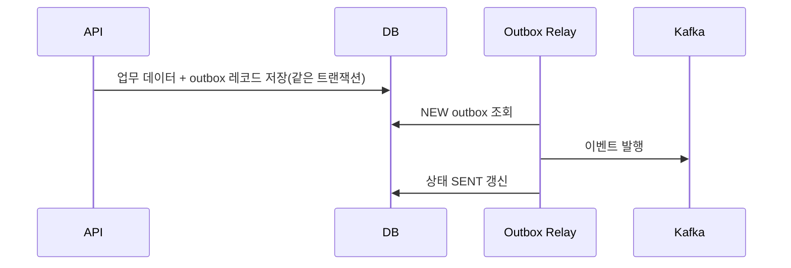

# Chapter 15 - Outbox와 이벤트 패턴

- 상태: 초안 완료
- 목표 분량: 11쪽

## 학습 목표
- Outbox 패턴 목적을 이해할 수 있다.
- DB-Kafka 이중 쓰기 문제를 설명할 수 있다.
- 이벤트 주도 통합 패턴을 설계할 수 있다.

## 핵심 개념

서비스가 DB와 Kafka에 각각 쓰는 이중 쓰기 상황은
장애 시 정합성 문제가 발생하기 쉽습니다.
Outbox 패턴은 DB 트랜잭션 안에 이벤트를 함께 기록하고,
별도 프로세스가 Kafka로 안전하게 발행하는 방식입니다.

## 직관 그림



핵심 해석:
- "업무 저장"과 "이벤트 기록"을 같은 DB 트랜잭션에 묶어
  이중 쓰기 정합성 리스크를 낮춥니다.

## 실습 예제

```text
업무 트랜잭션(DB) -> outbox 테이블 기록 -> outbox relay -> Kafka 토픽 발행 -> 발행 완료 마킹
```

## 설계 포인트
- outbox 레코드 상태 전이(NEW/SENT/FAILED)를 명확히 정의한다.
- relay 재시도와 중복 전송 방지 규칙을 둔다.
- 이벤트 순서 요구가 있으면 aggregate key 기반 발행을 설계한다.

## 자주 하는 실수
1. outbox 테이블 청소 정책 부재
2. relay 장애 감지/알림 없음
3. 발행 성공 기준 애매

## 요약
- Outbox는 이중 쓰기 정합성 문제를 줄이는 실전 패턴이다.
- 테이블 설계와 relay 운영이 성공 요인이다.

## 초보자 체크
- 이중 쓰기 실패가 왜 생기는지 말할 수 있는가?
- outbox relay 실패 시 재처리 흐름을 설명할 수 있는가?

## 연습문제
### 기초
1. 이중 쓰기 실패 시나리오를 작성해보세요.
2. outbox 상태 필드를 설계해보세요.

### 응용
1. outbox relay 장애 대응 절차를 설계해보세요.
2. outbox 정리 배치 정책을 작성해보세요.

## 챕터 체크리스트
- [x] 초안 작성 완료
- [ ] 예제 명령어 검증 완료
- [x] 초보자 기준 용어 설명 완료
- [ ] 최종 교정 완료
