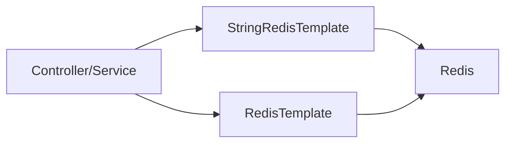

# Chapter 27 - Spring Boot Redis 기초

- 상태: 초안 완료
- 목표 분량: 8쪽

## 학습 목표

- Spring Boot에서 Redis 연결 기본 구성을 이해한다.
- `StringRedisTemplate`과 `RedisTemplate` 차이를 설명할 수 있다.
- 테스트 환경에서 Redis 통합 검증 방법을 정리할 수 있다.

## 핵심 개념

Spring Boot에서 Redis는 보통 Lettuce 클라이언트를 사용합니다.
값 포맷과 직렬화 전략을 먼저 정해야 운영 중 타입 오류를 줄일 수 있습니다.

Spring 통합에서 초보자가 가장 많이 겪는 문제는
"저장은 되는데 읽을 때 타입이 다르다"는 직렬화 불일치입니다.
따라서 프로젝트 시작 시 아래 3가지를 먼저 고정해야 합니다.

1. 키 네이밍 규칙
2. 값 포맷(String/JSON/바이너리)
3. TTL 기본 정책

## 직관 그림



```text
선택 기준
- 토큰/카운터/단순 문자열: StringRedisTemplate
- 객체 저장/복합 구조: RedisTemplate + 직렬화 규약
```

핵심 해석:
- 템플릿 선택보다 중요한 것은 "팀 단일 직렬화 규칙"입니다.
- 같은 키를 다른 포맷으로 읽지 않게 경계를 고정해야 합니다.

### 템플릿 선택

- `StringRedisTemplate`: 문자열 중심, 토큰/카운터에 단순
- `RedisTemplate<K,V>`: 객체 직렬화 커스터마이징 가능

팀 표준이 없으면 경로마다 템플릿이 섞여
같은 키를 다른 포맷으로 읽는 사고가 발생합니다.
인증/세션 경로는 `StringRedisTemplate`로 단순화하는 전략이 실무에서 자주 쓰입니다.

## 설정 예시(개념)

```yaml
spring:
  data:
    redis:
      host: localhost
      port: 6380
```

구성 경계 정리:

- 연결 설정: `application.yml`
- 직렬화 규칙: `RedisTemplate` 빈 설정
- 도메인 접근 규약: 별도 repository/service 계층

이 세 층을 분리하면
직렬화 변경이나 장애 폴백 정책을 코드 전체 수정 없이 제어할 수 있습니다.

## 설계 포인트

- 인증 경로는 문자열 포맷 통일 권장
- 직렬화 포맷 변경 시 버전 전략 적용
- Redis 장애 시 폴백 동작을 API 레벨에서 정의

추가 설계 포인트:

- 커넥션 풀/타임아웃/재시도 기본값을 서비스 SLA에 맞게 조정
- 장애 시 예외를 삼키지 말고 사용자 영향이 드러나는 응답 규약으로 처리
- 통합 테스트에서 TTL 존재 여부까지 검증

## 자주 하는 실수

1. 경로마다 다른 직렬화 포맷 사용
2. 연결 타임아웃/재시도 정책 미설정
3. 통합 테스트 없이 운영 배포

## 요약

- Spring Redis 통합의 핵심은 연결 자체보다 직렬화 표준화다.
- 템플릿/포맷/폴백 정책을 함께 설계해야 안정적이다.

## 초보자 체크

- `StringRedisTemplate`과 `RedisTemplate`을 어떤 기준으로 나눌지 설명할 수 있는가?
- 직렬화 규칙이 없을 때 실제로 어떤 장애가 나는지 예시를 말할 수 있는가?

## 연습문제

### 기초

1. `StringRedisTemplate` 기반 저장/조회 코드를 작성해보세요.
2. Redis 연결 실패 시 예외 흐름을 확인해보세요.

### 응용

1. 토큰 저장소 인터페이스를 설계해보세요.
2. Redis 통합 테스트 케이스 5개를 제시해보세요.

## 챕터 체크리스트

- [x] 초안 작성 완료
- [ ] 예제 명령어 검증 완료
- [x] 초보자 기준 용어 설명 완료
- [x] 최종 교정 완료
