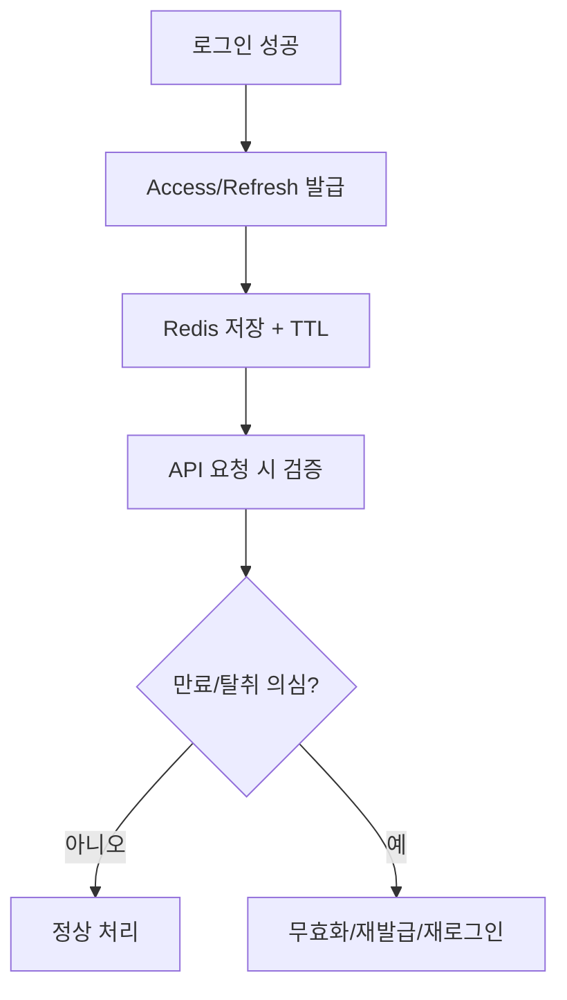

# Chapter 28 - 토큰/세션 설계

- 상태: 초안 완료
- 목표 분량: 8쪽

## 학습 목표

- 토큰/세션 키 스키마를 설계할 수 있다.
- TTL 중심 인증 정책을 구성할 수 있다.
- 단일 로그인/다중 기기 정책 차이를 설명할 수 있다.

## 핵심 개념

토큰/세션 데이터는 "짧은 수명 + 빠른 조회/삭제"가 핵심입니다.
Redis는 이 특성에 잘 맞습니다.

인증 설계에서 가장 중요한 것은
"정상 플로우"보다 "예외 플로우"입니다.
탈취, 중복 로그인, 로그아웃, 만료 경계 시점을 먼저 정의해야
키 스키마와 TTL 정책이 흔들리지 않습니다.

## 직관 그림



```text
키 스키마 예시

auth:refresh:user:{userId}:device:{deviceId}
auth:blacklist:jti:{tokenId}
auth:session:user:{userId}:device:{deviceId}
```

핵심 해석:
- 인증 데이터는 "발급"보다 "폐기/회수" 흐름이 더 중요합니다.
- 키 스키마와 TTL 정책이 예외 상황(탈취/중복 로그인) 처리 품질을 결정합니다.

### 데이터 모델 분리 원칙

- Access Token: 검증 비용 최소화, 짧은 수명
- Refresh Token: 재발급 제어, 더 긴 수명
- Session Metadata: 기기/IP/마지막 사용 시각 등 보조 정보

이 세 가지를 분리하면 보안 정책과 UX 정책을 독립적으로 조정하기 쉽습니다.

## 권장 키 스키마

- 단일 세션: `auth:refresh:user:{userId}`
- 다중 기기: `auth:refresh:user:{userId}:device:{deviceId}`

확장 키 예시:

- 회전 토큰 버전: `auth:refresh:user:{userId}:ver:{n}`
- 블랙리스트: `auth:blacklist:jti:{tokenId}`
- 세션 메타: `auth:session:user:{userId}:device:{deviceId}`

## TTL 정책 예시

- Access Token: 짧게(예: 10~30분)
- Refresh Token: 상대적으로 길게(예: 7~14일)

저장 시점에 TTL을 원자적으로 설정해야 합니다.

추가 원칙:

- 토큰 수명은 보안팀/제품팀 합의값으로 고정
- 만료 시간은 서버 기준(UTC)으로 일관 처리
- clock skew(시계 차이) 허용 범위를 설계에 반영

## 설계 포인트

- 로그아웃은 즉시 삭제 + 블랙리스트 정책 검토
- 토큰 회전(rotation) 시 이전 토큰 무효화 규칙 명확화
- 동시 로그인 정책을 제품 요구사항과 합치

정책 선택 프레임:

1. 보안 우선(single session)
- 계정 탈취 확산 억제에 유리
- 다기기 UX 불편 가능

2. 사용자 편의 우선(multi-device)
- 기기별 키 관리 필요
- 만료/회수 정책이 더 복잡

3. 혼합 정책
- 고위험 계정만 더 엄격한 세션 정책 적용

## 자주 하는 실수

1. TTL 없는 토큰 저장
2. 키 충돌 가능성이 있는 단순 네이밍
3. 로그인 정책 문서화 부재

## 요약

- 토큰/세션 설계의 핵심은 키 규칙, TTL, 정책 일관성이다.
- 보안과 사용자 경험을 함께 고려해 수명과 무효화를 설계해야 한다.

## 초보자 체크

- Access와 Refresh를 분리 저장해야 하는 이유를 설명할 수 있는가?
- 단일 세션 정책과 다중 기기 정책의 트레이드오프를 말할 수 있는가?

## 연습문제

### 기초

1. 단일 세션 키 스키마를 설계해보세요.
2. Access/Refresh TTL을 서비스 요구에 맞게 정해보세요.

### 응용

1. 다중 기기 정책으로 전환 시 키 이전 계획을 작성해보세요.
2. 로그아웃/탈취 대응 플로우를 설계해보세요.

## 챕터 체크리스트

- [x] 초안 작성 완료
- [ ] 예제 명령어 검증 완료
- [x] 초보자 기준 용어 설명 완료
- [x] 최종 교정 완료
