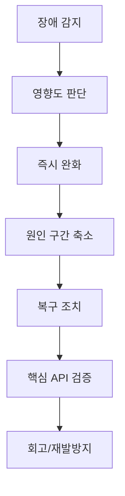

# Chapter 29 - 장애 대응/복구 런북

- 상태: 초안 완료
- 목표 분량: 8쪽

## 학습 목표

- Redis 장애 시 즉시 대응 순서를 정의할 수 있다.
- 서비스 영향 분석과 커뮤니케이션 기준을 수립할 수 있다.
- 복구 후 재발 방지 항목을 정리할 수 있다.

## 핵심 개념

런북은 "문서"가 아니라 "반복 가능한 행동 순서"입니다.
장애 시 가장 중요한 것은 빠르고 일관된 판단입니다.

런북 품질은 "길이"가 아니라 "실행 가능성"으로 평가해야 합니다.
누가, 언제, 무엇을, 어떤 기준으로 하는지가 빠지면
문서는 있어도 실제 장애에서는 작동하지 않습니다.

### 런북의 3층 구조

1. 즉시 대응(0~10분)
- 감지, 영향도 파악, 임시 완화

2. 복구 대응(10~60분)
- 원인 구간 좁히기, 서비스 복구, 검증

3. 사후 대응(당일~D+7)
- 회고, 재발방지, 문서/알림 기준 업데이트

## 직관 그림



```text
시간축 예시

00:00 감지
00:03 영향도 공지
00:07 임시 완화
00:20 원인 후보 축소
00:35 복구 완료
00:45 검증/정상화 공지
```

핵심 해석:
- 장애 중에는 "완벽한 원인 규명"보다 "사용자 영향 축소"가 먼저입니다.
- 분 단위 타임라인 기록이 회고 품질과 재발 방지의 출발점입니다.

## 표준 대응 절차

1. 감지
- 헬스체크, 오류율, p95 급등 확인

2. 영향도 파악
- 인증 실패율, 캐시 미스 폭증 여부 확인

3. 임시 완화
- 필요 시 트래픽 제한, 재로그인 안내

4. 복구
- Redis 연결/노드 상태 복구
- 애플리케이션 재연결 확인

5. 검증
- 핵심 API 성공률/지연 확인

6. 회고
- 원인, 조치, 재발 방지책 기록

실무 팁:

- 장애 중에는 "완화 우선, 분석 후행" 원칙 유지
- 타임라인을 분 단위로 기록해 회고 품질 확보
- 상태 공유 채널(슬랙/문자/페이지)의 템플릿 문구 사전 준비

## 설계 포인트

- 알림 기준(오탐/미탐) 주기적 보정
- 온콜 담당자 역할 분담 명확화
- 장애 후 문서 업데이트를 필수 작업으로 지정

추가 설계 포인트:

- 장애 등급(Sev1/Sev2 등) 정의와 의사결정 권한 명시
- 에스컬레이션 조건(몇 분 지연 시 누구 호출) 고정
- 복구 완료 선언 기준(정상 지표 임계치) 수치화

## 자주 하는 실수

1. 장애 중 원인 분석에만 몰입하고 완화 조치를 늦춤
2. 복구 후 검증을 생략
3. 회고를 남기지 않아 같은 사고 반복
4. 커뮤니케이션 문구 부재로 사용자/내부 혼선 발생

## 요약

- 런북의 목적은 "같은 사고를 더 빨리, 더 안전하게" 처리하는 것이다.
- 감지-완화-복구-검증-회고 순서를 고정하면 운영 안정성이 올라간다.

## 초보자 체크

- 왜 장애 중에는 "완화 우선" 원칙이 필요한지 설명할 수 있는가?
- 복구 완료 선언 전에 반드시 확인할 지표 3가지를 말할 수 있는가?

## 연습문제

### 기초

1. Redis 장애 대응 1페이지 런북을 작성해보세요.
2. 장애 알림 임계치 3개를 제안해보세요.

### 응용

1. 온콜 시나리오 드릴 계획을 설계해보세요.
2. 복구 후 검증 API 목록을 정의해보세요.

## 챕터 체크리스트

- [x] 초안 작성 완료
- [ ] 예제 명령어 검증 완료
- [x] 초보자 기준 용어 설명 완료
- [x] 최종 교정 완료
